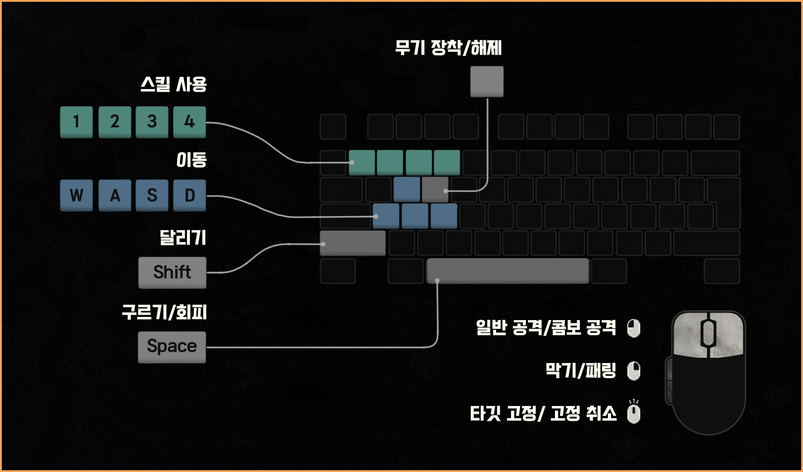

# ⚔️ Souls of Ruin (소울즈 오브 루인)

> **"끝없는 어둠 속에서 피어나는 쌍검의 불꽃, 파멸의 끝에서 영혼의 투쟁이 시작된다."**

**Souls of Ruin**은 언리얼 엔진 5와 **Gameplay Ability System(GAS)**을 기반으로 제작된 **소울라이크 액션 RPG**입니다.

이 프로젝트는 단순히 기능 구현에 그치지 않고, 플레이어·적·보스가 공통으로 사용하는 견고한 전투 구조를 설계하고, **무기·스킬·대미지·AI·연출까지 하나의 흐름으로 묶어** 일관성 있고 몰입감 높은 전투 경험을 구현하는 것을 목표로 했습니다.

---

## 📋 프로젝트 개요

| 항목 | 내용 |
| :--- | :--- |
| **프로젝트명** | Souls of Ruin |
| **개발 기간** | 2025.03.01 ~ 2025.10.24 (약 7개월) |
| **개발 인원** | 1인 (개인 프로젝트) |
| **사용 엔진** | Unreal Engine 5.4.4 |
| **플랫폼** | PC (Windows) |

---

## 🛠️ 기술 스택 (Tech Stack)

| 구분 | 사용 기술 |
| :--- | :--- |
| **엔진** | **Unreal Engine 5.4.4** |
| **언어** | **C++**, **Blueprint** |
| **IDE** | Visual Studio 2022 |
| **버전 관리** | Git, GitHub |
| **주요 기술** | Gameplay Ability System (GAS), Motion Warping, AI Module (Behavior Tree, EQS), Niagara VFX |

---

## 💡 핵심 개발 목표 및 특징

### 1️⃣ 일관된 전투 파이프라인 (Unified Combat Pipeline)
전투의 시작부터 끝까지, 숫자(데이터)와 연출(비주얼)이 완벽하게 동기화되는 전투 UX를 구현했습니다.
*   **단일 구조 설계**: `무기 오버랩 → 적대 판정 → 대미지 계산 → 피격 연출 → 사망 처리`에 이르는 전 과정을 하나의 파이프라인으로 통합했습니다.
*   **피드백의 일치**: 실제 대미지가 들어가는 타이밍과 피격 애니메이션, 이펙트, 사운드를 프레임 단위로 동기화하여 타격감을 극대화했습니다.

### 2️⃣ 확장 가능한 무기·스킬 프레임워크
GAS와 Gameplay Tags를 활용하여 높은 확장성을 가진 시스템을 구축했습니다.
*   **태그 기반 시스템**: 무기 장착 시 해당 무기에 할당된 태그를 통해 스킬 아이콘, 쿨타임, 사용 가능한 어빌리티가 자동으로 교체됩니다.
*   **모듈화**: 새로운 무기나 스킬을 추가할 때 기존 코드를 수정할 필요 없이, 데이터 에셋(Data Asset) 설정만으로 확장이 가능합니다.

### 3️⃣ 전투 경험을 살리는 이동 및 AI 설계
액션의 '맛'을 살리면서도 전략적인 전투가 가능하도록 이동과 AI를 정교하게 튜닝했습니다.
*   **정밀한 판정**: **Root Motion**과 **Motion Warping**을 결합하여, 공격 애니메이션이 적의 위치에 정확히 꽂히도록 구현했습니다. (허공을 가르는 공격 방지)
*   **지능적인 적**: **Detour Crowd**와 **EQS(Environment Query System)**를 활용하여 적들이 서로 겹치지 않고 플레이어를 포위하거나, 보스가 최적의 공격 위치를 선정합니다.
*   **보스 패턴**: 보스의 공격이 플레이어에게 '읽히면서도' 타이밍을 뺏는 긴장감을 주도록 패턴을 설계했습니다.

---

## 🕹️ 조작 방법 (Controls)

---